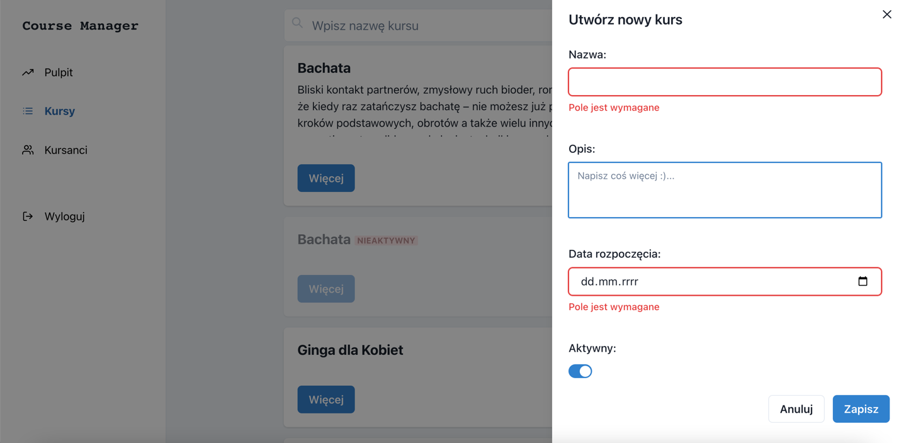
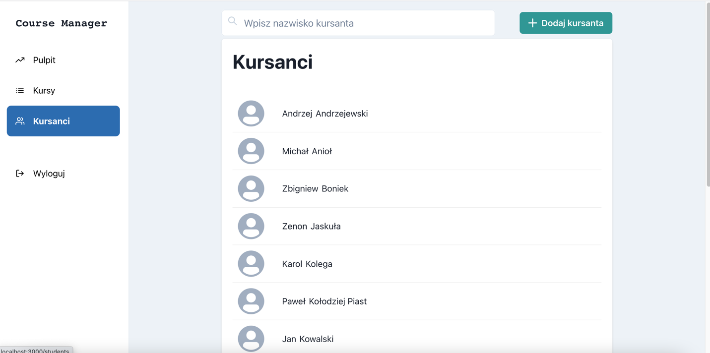
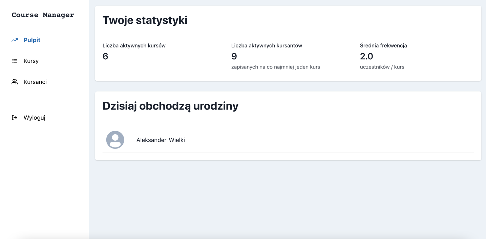
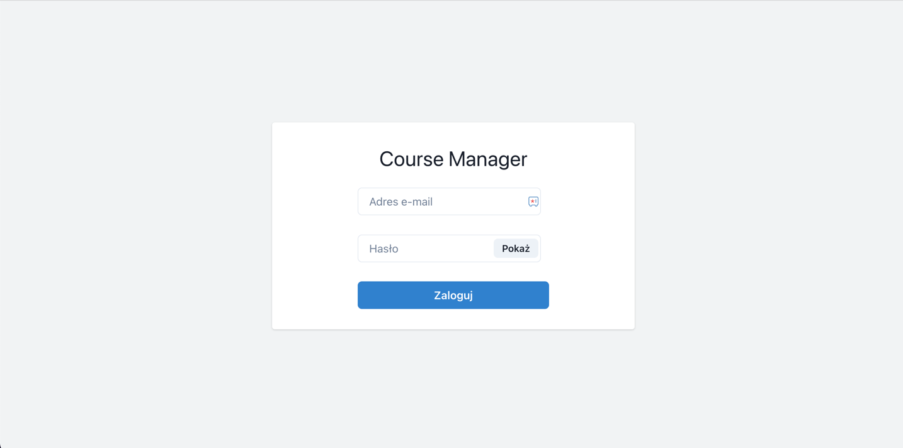
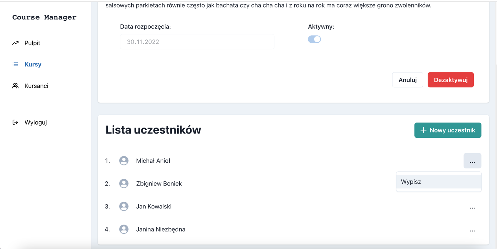

# Course Manager

## Table of Contents

1. [About the Project](#About-the-Project)
    1. [Demo](#Demo)
    2. [Features](#Features)
    3. [Tech Stack](#Tech-Stack)
    4. [Roadmap](#Roadmap)
2. [Getting Started](#Getting-Started)
3. [Contact](#Contact)

## 📙About the Project

This project is an application created to manage courses and their participants. It
can be useful for all kinds of coaches, instructors and teachers.

Main goals of this project was to practice making full-stack application with React.js and Node.js, and working with
MySQL database.

Front-end repository - https://github.com/madradeus/Course-Manager-back.git

### 👓Demo

Demo link

### 🎆‍Features

- listing courses with filter,
- single course details,
- creating new course,
- activating/deactivating course,
- listing students with filter,
- single student details,
- creating new students,
- removing students,
- subscribe/unsubscribe,
- stats,
- login/logout,

### 🧑‍💻Tech Stack

- typescript 4.9.5,
- react: 18.2.0,
- react-hook-form: 7.43.3,
- react-router-dom: 6.8.2,
- axios": 1.3.4,
- chakra-ui/react 2.5.1,

### ⏩Roadmap

- attendance list,
- payments monitor & notifications,

## 🚀Getting Started

Clone the project

### `git clone https://github.com/madradeus/Course-Manager-back.git`

Install dependencies

### `npm install`

Start the server development

### `npm start`

Start the watch mode

### `npm run start:dev`

Open http://localhost:3000 to view it in the browser.

## 🤝Contact

[Mateusz Rodowski](mailto:mateusz.rodowski@gmail.com?subject=[GitHub]) |
mateusz.rodowski@gmail.com
Back-end repository

- [https://github.com/madradeus/Course-Manager-back](https://github.com/madradeus/Course-Manager-back)

### 👓Demo

Demo link

### 🎆‍Features

- listing courses with filter,
- single course details,
- creating new course,
- activating/deactivating course,
- listing students with filter,
- single student details,
- creating new students,
- removing students,
- subscribe/unsubscribe,
- stats,
- login/logout,

### 🧑‍💻Tech Stack

- typescript 4.9.5,
- react: 18.2.0,
- react-hook-form: 7.43.3,
- react-router-dom: 6.8.2,
- axios": 1.3.4,
- chakra-ui/react 2.5.1,

### ⏩Roadmap

- attendance list,
- payments monitor & notifications,

## 🚀Getting Started

Clone the project

#### `git clone https://github.com/madradeus/Course-Manager-front.git`

Install dependencies

#### `npm install`

Start the server

#### `npm start`

Open [http://localhost:3000](http://localhost:3000) to view it in the browser.

## 🤝Contact

[Mateusz Rodowski](mailto:mateusz.rodowski@gmail.com?subject=[GitHub]) |
mateusz.rodowski@gmail.com